## 1. Test Plan 1: `/all-student`

**HTTP Request Configuration**
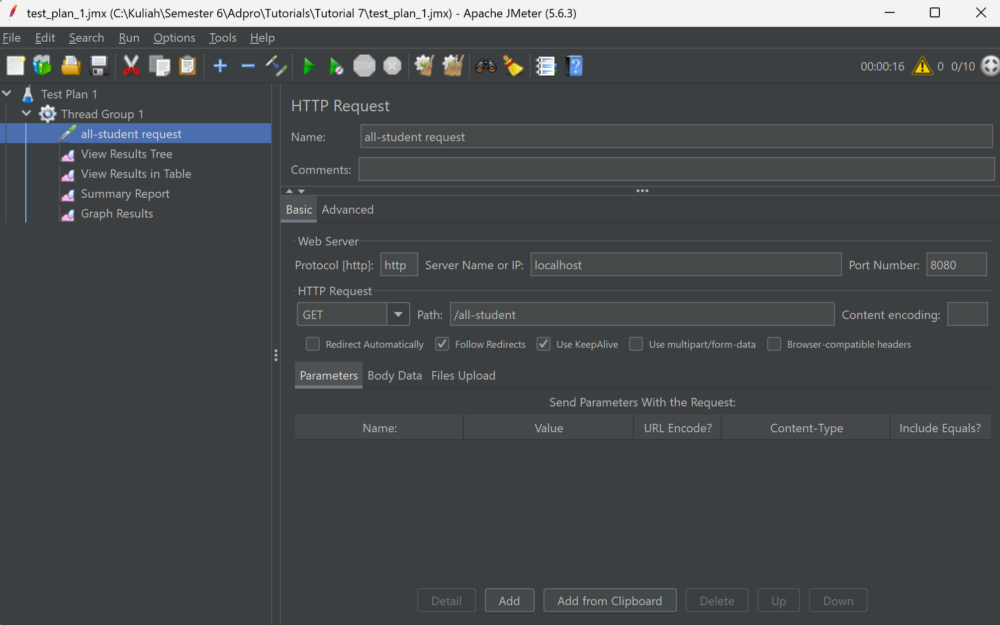

**View Results Tree**
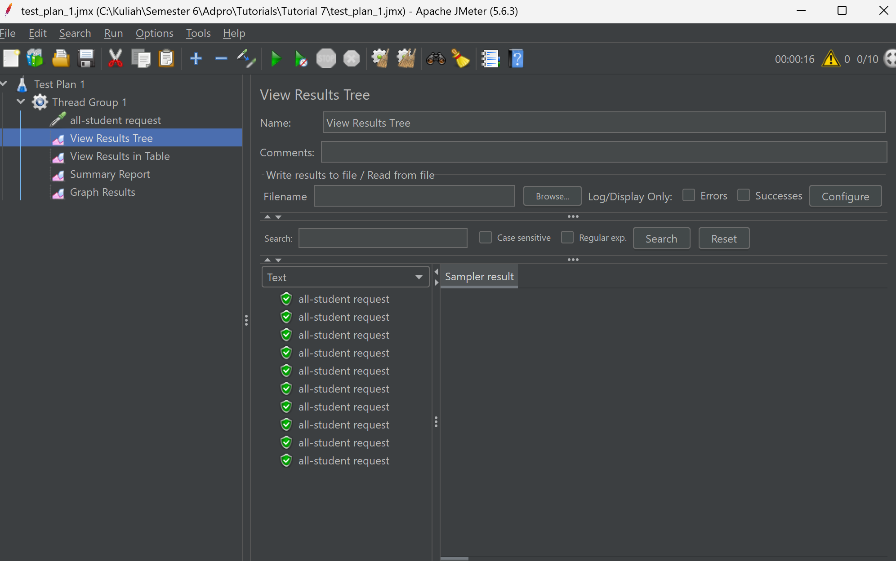

**View Results in Table**
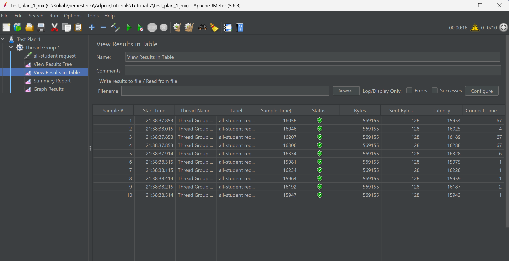

**Summary Report**
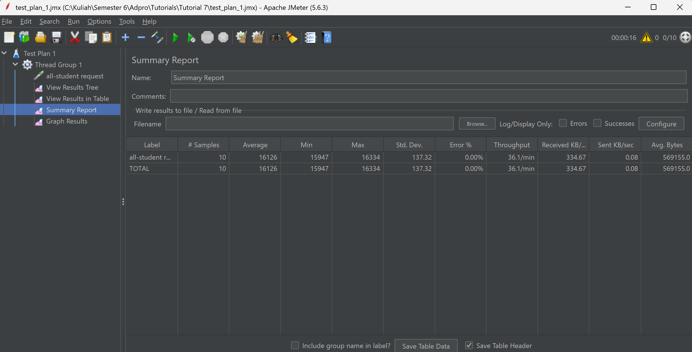

**Graph Results**
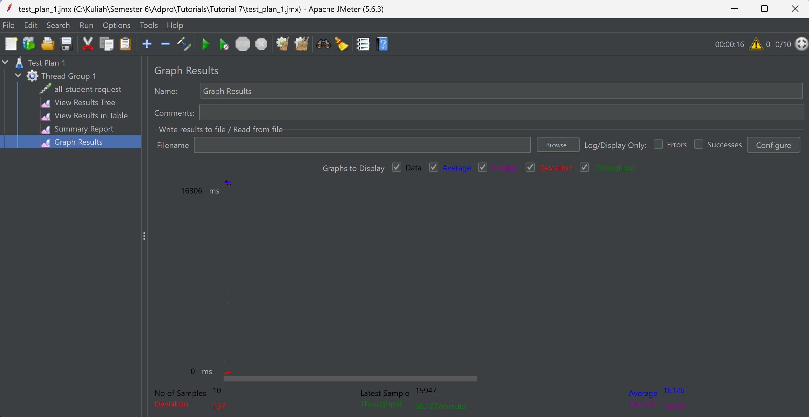

---

## 2. Test Plan 2: `/all-student-name`

**HTTP Request Configuration**

**View Results Tree**
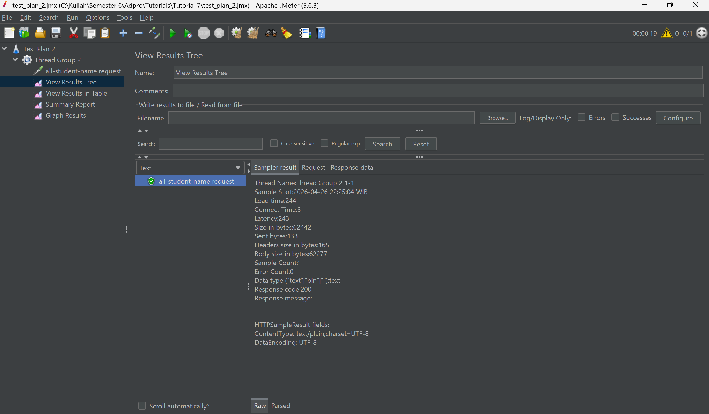

**View Results in Table**
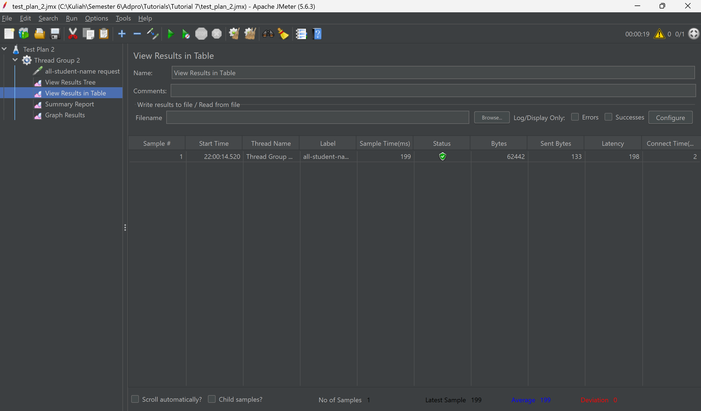

**Summary Report**

**Graph Results**
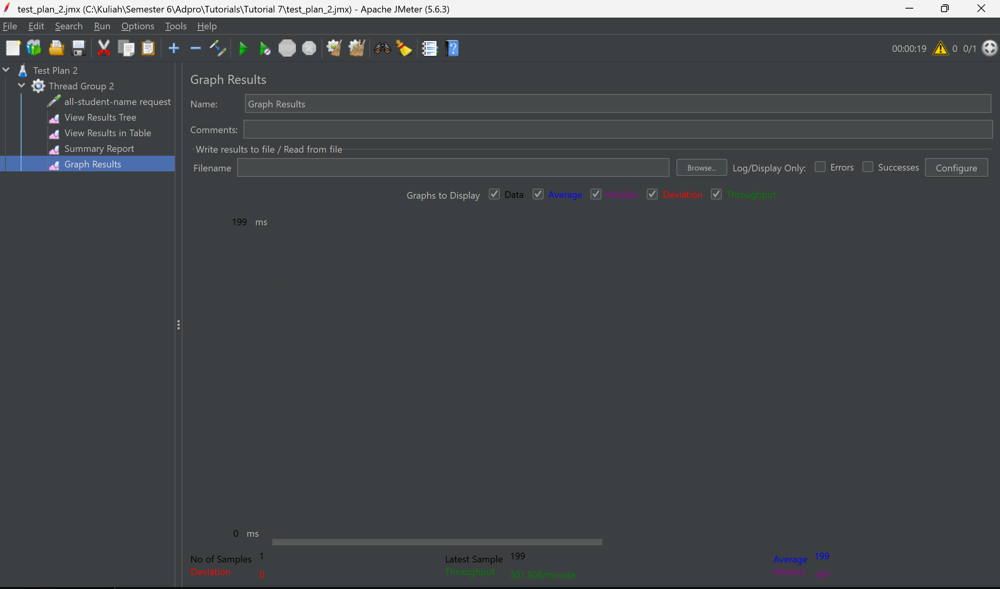

---

## 3. Test Plan 3: `/highest-gpa`

*(Catatan: Gambar di bawah ini memanggil folder `img-testplan3`. Sesuaikan nama file jika ada perbedaan)*

**HTTP Request Configuration**
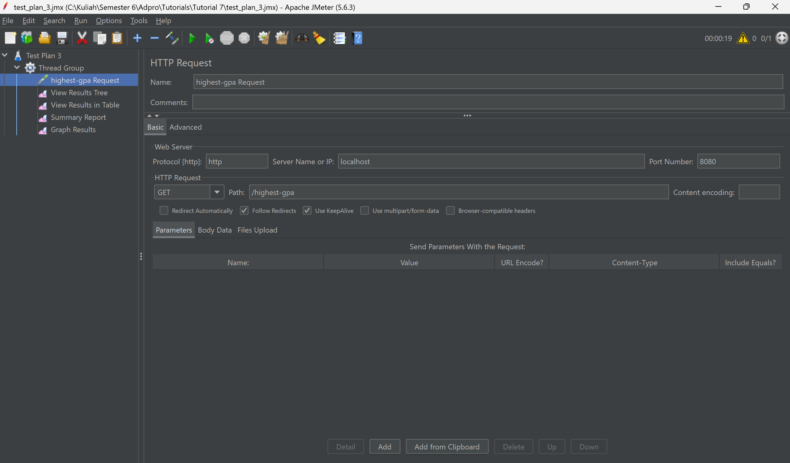

**View Results Tree**
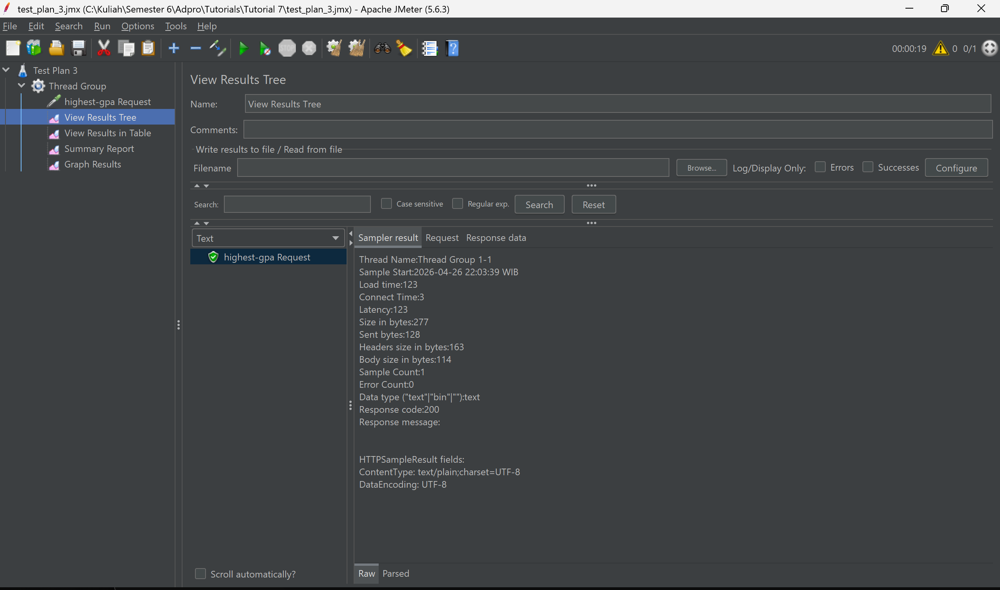

**View Results in Table**
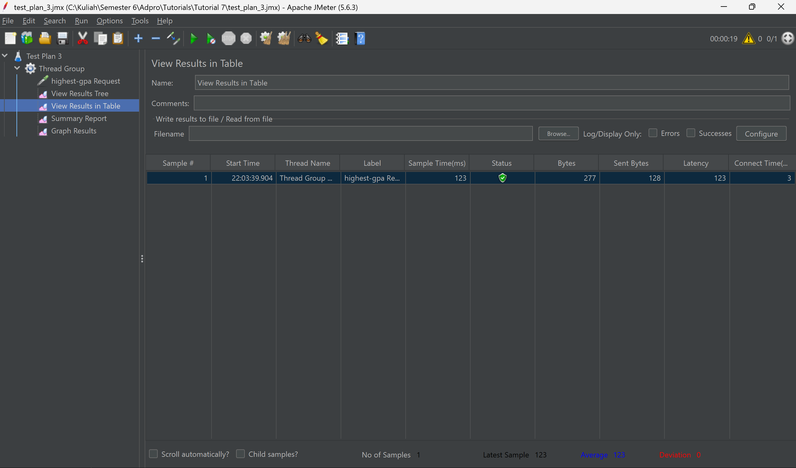

**Summary Report**
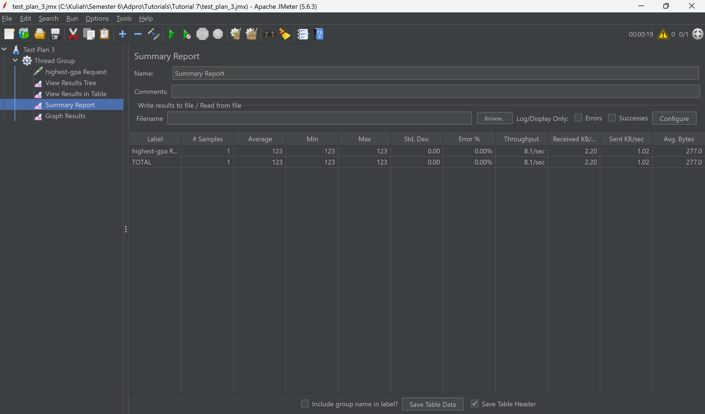

**Graph Results**
