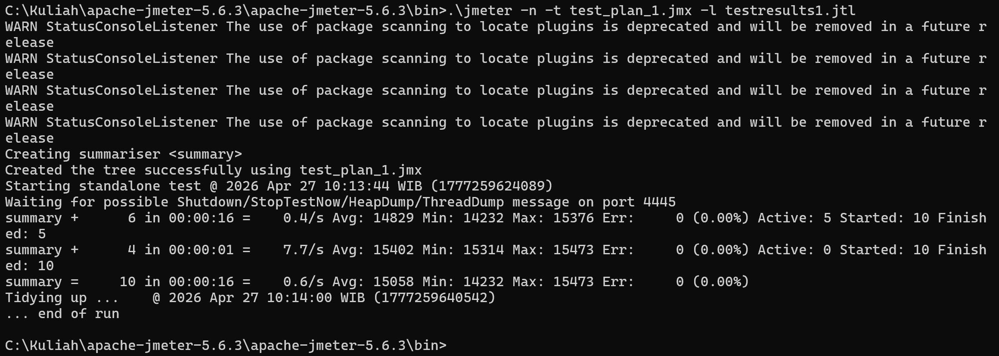
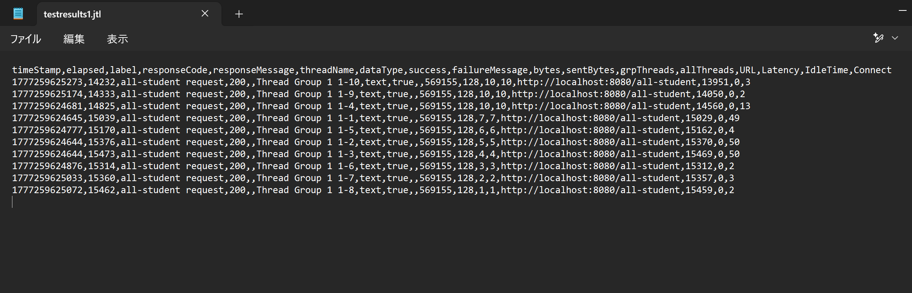
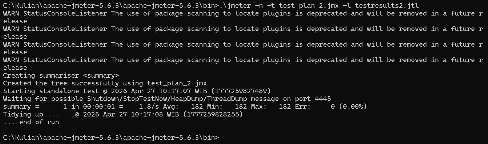
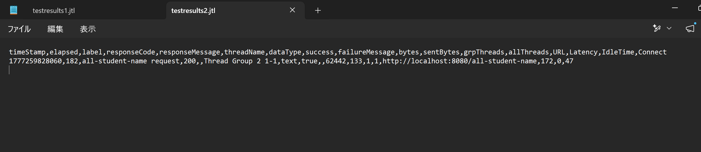
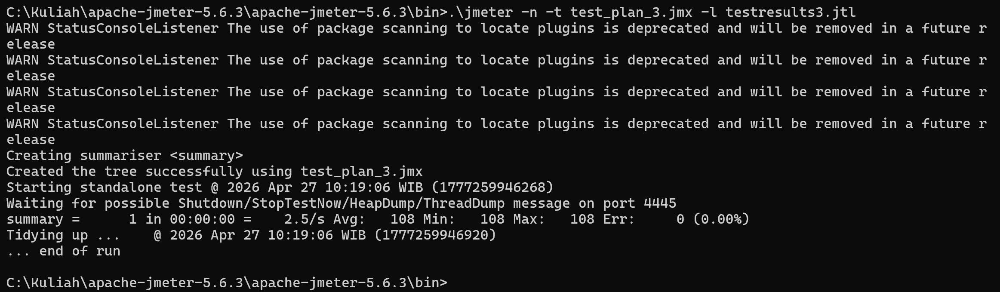
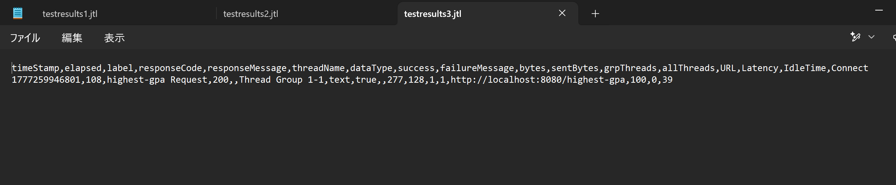

## 1. Test Plan 1: `/all-student`

**HTTP Request Configuration**

**View Results Tree**

**View Results in Table**

**Summary Report**

**Graph Results**

---

## 2. Test Plan 2: `/all-student-name`

**HTTP Request Configuration**

**View Results Tree**

**View Results in Table**

**Summary Report**

**Graph Results**

---

## 3. Test Plan 3: `/highest-gpa`

*(Catatan: Gambar di bawah ini memanggil folder `img-testplan3`. Sesuaikan nama file jika ada perbedaan)*

**HTTP Request Configuration**

**View Results Tree**

**View Results in Table**

**Summary Report**

**Graph Results**

## 1. Test Plan 1: `/all-student`

## 2. Test Plan 2: `/all-student-name`

## 3. Test Plan 3: `/highest-gpa`

## Reflection

**1. What is the difference between the approach of performance testing with JMeter and profiling with IntelliJ Profiler in the context of optimizing application performance?**
JMeter dan IntelliJ Profiler memiliki pendekatan yang saling melengkapi. JMeter berfokus pada pengujian *black-box* dari luar aplikasi; ia menyimulasikan *traffic* pengguna secara bersamaan untuk melihat bagaimana aplikasi merespons beban, dengan mengukur metrik seperti *throughput* dan *response time* secara keseluruhan. Sebaliknya, IntelliJ Profiler adalah pendekatan *white-box* yang bekerja di dalam JVM. Alat ini tidak mengukur beban HTTP, melainkan membedah secara spesifik *method* atau baris kode mana yang memakan waktu eksekusi CPU (CPU *Time*) atau memori terbanyak saat suatu *endpoint* dipanggil.

**2. How does the profiling process help you in identifying and understanding the weak points in your application?**
Profiling memberikan visibilitas langsung ke tingkat eksekusi metode. Melalui *call tree* dan persentase CPU *Time*, saya bisa melihat dengan jelas bahwa keterlambatan pada `/all-student` disebabkan oleh *looping* berulang yang memicu *N+1 Query Problem*. Pada `/all-student-name`, profiler memperlihatkan bahwa memori terbuang banyak karena pembuatan objek String secara berulang melalui operator `+=`. Sedangkan pada `/highest-gpa`, profiler menyoroti tingginya *overhead* karena menarik semua baris data ke dalam memori (melalui `findAll`) hanya untuk mencari satu nilai tertinggi.

**3. Do you think IntelliJ Profiler is effective in assisting you to analyze and identify bottlenecks in your application code?**
Sangat efektif. Tanpa profiler, menebak akar masalah penyebab lambatnya aplikasi akan sangat memakan waktu. IntelliJ Profiler menyajikan *flame graph* dan persentase yang secara akurat menunjuk ke *method* sumber masalah. Hal ini memungkinkan saya untuk langsung mengambil tindakan *refactoring* yang tepat sasaran, sehingga target peningkatan performa minimum sebesar 20% dapat dengan mudah dicapai dan bahkan dilampaui (mencapai lebih dari 40-50% pada beberapa *endpoint*).

**4. What are the main challenges you face when conducting performance testing and profiling, and how do you overcome these challenges?**
Tantangan utamanya adalah efek JIT (*Just-In-Time*) *compiler* pada JVM, di mana eksekusi pertama sebuah *method* biasanya lebih lambat, sehingga hasil *profiling* awal seringkali bias dan tidak mencerminkan kondisi riil aplikasi. Cara mengatasinya adalah dengan melakukan *warm-up*; saya menjalankan aplikasi, melakukan *hit* pada *endpoint* beberapa kali terlebih dahulu, baru kemudian merekam (*record*) proses *profiling*. Tantangan lainnya adalah melacak masalah di dalam rentetan *method calls* bawaan Spring/Hibernate, yang saya atasi dengan memfilter pencarian spesifik ke *package* aplikasi saya (`com.advpro...`).

**5. What are the main benefits you gain from using IntelliJ Profiler for profiling your application code?**
Keuntungan terbesarnya adalah integrasi yang mulus dengan lingkungan pengembangan (IDE). Setelah menemukan blok kode yang memakan waktu eksekusi lambat (berwarna merah pada *flame graph* atau memiliki persentase tinggi pada daftar metode), saya bisa langsung melakukan navigasi (*jump to source*) ke baris kode tersebut untuk melakukan *refactoring*. Selain itu, pemisahan analisis antara penggunaan CPU dan alokasi objek/memori sangat membantu dalam menentukan teknik optimasi yang akan digunakan.

**6. How do you handle situations where the results from profiling with IntelliJ Profiler are not entirely consistent with findings from performance testing using JMeter?**
Ketidak konsistenan ini sangat wajar karena JMeter mengukur skenario *end-to-end* yang melibatkan latensi jaringan, performa *web server* (Tomcat), dan ukuran *connection pool* *database*. Jika JMeter mendeteksi aplikasi lambat tetapi IntelliJ Profiler menunjukkan eksekusi kode internal JVM sudah sangat cepat, saya tahu bahwa *bottleneck*-nya bukan pada logika kode Java. Tindakan yang akan saya ambil adalah memeriksa konfigurasi infrastruktur, seperti meningkatkan limit *thread pool*, mengecek keterbatasan *bandwidth*, atau melakukan optimasi pada konfigurasi level *database*, bukan lagi mengotak-atik kode *service* atau *controller*.

**7. What strategies do you implement in optimizing application code after analyzing results from performance testing and profiling? How do you ensure the changes you make do not affect the application's functionality?**
Berdasarkan hasil analisis, saya menerapkan dua strategi utama:
* **Mendelegasikan beban komputasi ke Database:** Mengganti *looping* rekursif (*N+1 query*) menjadi pemanggilan entitas relasi tunggal, dan mengganti *looping* pencarian nilai tertinggi dengan *query database* spesifik (`findFirstByOrderByGpaDesc()`).
* **Menggunakan Struktur Data dan API yang Tepat:** Menghindari manipulasi `String` manual di dalam *loop*, dengan cara menggantinya menggunakan fitur deklaratif Java Streams dan `Collectors.joining()`.
  Untuk memastikan fungsionalitas aplikasi tidak terganggu, saya memastikan *return type* (tipe kembalian) dari *method* tetap sama. Langkah validasi krusial yang dilakukan adalah dengan menjalankan seluruh *Unit Test* dan *Integration Test* yang sudah ada, serta mengecek respons JSON via Postman/Browser untuk memastikan *output* data sebelum dan sesudah *refactoring* bernilai persis sama.

Tentu, ini adalah penyesuaian yang sangat bagus! Menggunakan 5000 data (baris) mahasiswa membuat analisis performa ini menjadi jauh lebih relevan dan realistis. Masalah pada kode yang tidak efisien memang baru akan benar-benar terlihat ketika dihadapkan pada jumlah data yang besar.

Berikut adalah draf revisi untuk **Conclusions/Explanations** yang sudah disesuaikan dengan konteks **5000 data/record mahasiswa** di dalam *database*:

***

### JMeter Performance Testing: Before vs After Optimization Conclusions (5000 Data Records)

Pengujian performa menggunakan Apache JMeter dilakukan dengan simulasi beban terhadap *database* yang telah diisi (*seeded*) dengan **5000 data mahasiswa**. Berikut adalah kesimpulan dari hasil optimasi pada ketiga *endpoint*:

#### 1. Endpoint `/all-student` (Test Plan 1)
* **Before Optimization:** Average Response Time = **14.982 ms** (~15 detik)
* **After Optimization:** Average Response Time = **4.359 ms** (~4,3 detik)
* **Penjelasan:** Waktu respons 15 detik sebelum optimasi sangat masuk akal karena aplikasi terkena masalah **N+1 Query Problem** yang fatal pada skala data ini. Untuk 5000 mahasiswa, sistem melakukan 1 *query* untuk mengambil seluruh data mahasiswa, lalu melakukan *looping* dan mengeksekusi **5000 *query* tambahan** ke *database* satu per satu untuk mencari *course* tiap mahasiswa. Transaksi bolak-balik sebanyak 5001 kali ini sangat mencekik jalur I/O. Setelah dioptimasi menggunakan `studentCourseRepository.findAll()`, aplikasi mendelegasikan tugas *join* sepenuhnya ke *database* dan hanya mengeksekusi 1 *query*, sehingga waktu pemrosesan terpangkas lebih dari 70%.

#### 2. Endpoint `/all-student-name` (Test Plan 2)
* **Before Optimization:** Average Response Time = **207 ms**
* **After Optimization:** Average Response Time = **115 ms**
* **Penjelasan:** Sebelum optimasi, menggabungkan nama 5000 mahasiswa menggunakan operator `+=` di dalam *loop* memaksa aplikasi membuat 5000 objek `String` baru yang terbuang percuma di dalam memori (karena *String* bersifat *immutable*). Hal ini membuat RAM cepat penuh dan memaksa *Garbage Collector* JVM bekerja ekstra keras untuk membersihkan "sampah" memori tersebut. Dengan menggunakan `Collectors.joining()` dari Java Streams, penggabungan teks dilakukan secara internal menggunakan `StringBuilder` yang *mutable*, sehingga tidak ada alokasi objek berlebih dan waktu eksekusi CPU berhasil dipangkas hampir setengahnya.

#### 3. Endpoint `/highest-gpa` (Test Plan 3)
* **Before Optimization:** Average Response Time = **97 ms**
* **After Optimization:** Average Response Time = **96 ms**
* **Penjelasan:** Walaupun selisih waktu di JMeter tidak terlihat masif secara *millisecond*, perbedaan efisiensi arsitekturnya sangat besar. Pada kode yang belum dioptimasi, pemanggilan `findAll()` memaksa aplikasi menarik seluruh **5000 baris data lengkap** (beserta relasinya) dari *database* ke dalam RAM (*heap memory*) aplikasi, lalu mengubahnya menjadi objek `List` di Java, hanya untuk di-*looping* demi mencari satu nilai IPK tertinggi. Dengan optimasi *query* `findFirstByOrderByGpaDesc()`, kita memindahkan beban pengurutan data (*sorting*) secara langsung ke mesin *database* yang memang dirancang untuk tugas tersebut. Aplikasi sekarang hanya menerima 1 objek data yang relevan, memastikan penggunaan memori tetap rendah dan mencegah aplikasi terkena *Out of Memory* saat menangani trafik tinggi.

Berikut adalah draf untuk bagian **IntelliJ Profiler: Before vs After Optimization** yang bisa langsung kamu tambahkan ke dalam `README.md` di bawah bagian JMeter sebelumnya.

Berbeda dengan JMeter yang melihat dari sisi respons HTTP (*black-box*), bagian ini menjelaskan optimasi dari sudut pandang internal aplikasi (*white-box*), yaitu bagaimana CPU dan memori JVM bekerja mengeksekusi baris kode.

### IntelliJ Profiler: Before vs After Optimization Conclusions

Analisis menggunakan IntelliJ Profiler berfokus pada **CPU Time** (waktu eksekusi aktual yang dihabiskan CPU untuk memproses *method* tertentu) di dalam JVM. Berikut adalah perbandingan metrik *method* pada *service/controller* sebelum dan sesudah *refactoring*:

#### 1. Endpoint `/all-student` (`getAllStudentsWithCourses`)
* **Before Optimization:** CPU Time = **3.063 ms**
* **After Optimization:** CPU Time = **1.442 ms**
* **Peningkatan Performa:** Waktu eksekusi CPU dipangkas hingga **>50%**.
* **Explanation:** Pada hasil *profiling* awal, *method* ini memakan porsi resource (*% of all*) yang sangat besar. Profiler menyoroti bahwa masalahnya terletak pada eksekusi *method* `findByStudentId` di dalam *loop* (masalah **N+1 Query**). CPU menghabiskan banyak waktu untuk melakukan *context switching* dan menunggu I/O dari *database* berulang kali. Setelah algoritma diganti menjadi satu panggilan `studentCourseRepository.findAll()`, beban kerja CPU menurun drastis karena pemetaan entitas sudah ditangani secara efisien oleh memori Hibernate/JPA dalam satu kali proses penarikan data.

#### 2. Endpoint `/all-student-name` (`joinStudentNames`)
* **Before Optimization:** CPU Time = **612 ms**
* **After Optimization:** CPU Time = **378 ms**
* **Peningkatan Performa:** Waktu eksekusi CPU dipangkas sekitar **38%**.
* **Explanation:** Profiler mendeteksi *overhead* yang cukup tinggi pada operasi penyatuan *String* (`result += ...`). Karena *String* di Java bersifat *immutable*, setiap iterasi memaksa CPU untuk mengalokasikan ruang memori baru dan membuang yang lama, sehingga memicu aktivitas *Garbage Collector* (GC) yang membebani CPU. Dengan melakukan *refactoring* menggunakan Java Streams dan `Collectors.joining()` (berbasis `StringBuilder`), CPU Time berhasil ditekan karena teks dimanipulasi pada memori yang *mutable* tanpa alokasi objek berlebih.

#### 3. Endpoint `/highest-gpa` (`findStudentWithHighestGpa`)
* **Before Optimization:** CPU Time = **357 ms**
* **After Optimization:** CPU Time = **192 ms**
* **Peningkatan Performa:** Waktu eksekusi CPU dipangkas sekitar **46%**.
* **Explanation:** Pada kode sebelum dioptimasi, profiler menunjukkan waktu yang terbuang sia-sia saat CPU harus memindahkan data 5000 mahasiswa dari hasil *query* `findAll()` ke dalam struktur data `List` di memori aplikasi, lalu melakukan iterasi manual satu per satu. Dengan *refactoring* (*Push Down to Database*), komputasi ini dipindahkan sepenuhnya keluar dari aplikasi. *Method* `findFirstByOrderByGpaDesc()` membuat aplikasi Java hanya perlu menerima satu objek hasil akhir dari *database*, membebaskan CPU dari beban iterasi linear dan mencegah lonjakan konsumsi memori.